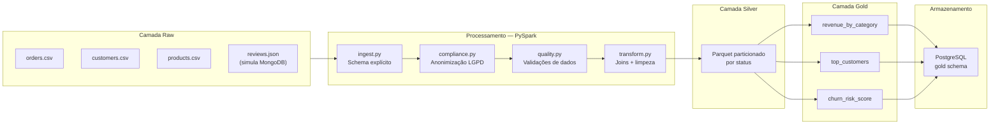

# Ecommerce Data Pipeline

[](https://python.org)
[](https://spark.apache.org)
[](https://airflow.apache.org)
[](https://postgresql.org)
[](https://mongodb.com)
[](https://docker.com)
[](https://pytest.org)
[](https://www.gov.br/cidadania/pt-br/acesso-a-informacao/lgpd)

Pipeline de dados de ponta a ponta para um contexto de **e-commerce**, implementando a **Arquitetura Medallion** (Raw → Silver → Gold). Processa pedidos brutos com PySpark, aplica validações de qualidade, anonimiza PII em conformidade com a LGPD e entrega métricas analíticas prontas para consumo — orquestrado por Apache Airflow.

> **Problema de negócio:** Uma plataforma de e-commerce precisa transformar dados brutos de pedidos, clientes e produtos em três insights críticos: **quais categorias geram mais receita**, **quem são os melhores clientes** e **quem está em risco de churn**. Esse pipeline responde às três perguntas de forma automatizada e auditável.

---

## Arquitetura — Medallion Architecture



### Fluxo de orquestração (Airflow)

```
start → ingest → compliance → quality_gate → transform_silver → analytics_gold → load_postgres → end
```

Cada task é independente e re-executável. Se o `quality_gate` falhar, o pipeline para e o Airflow dispara retry automático.

---

## Tecnologias

| Camada | Tecnologia | Finalidade |
|--------|-----------|-----------|
| Processamento | **PySpark 3.5** | DataFrames distribuídos, Spark SQL, transformações |
| Orquestração | **Apache Airflow 2.9** | DAG diária, retry automático, monitoramento visual |
| Armazenamento relacional | **PostgreSQL 15** | Camada Gold para consumo analítico via SQL |
| Fonte não relacional | **MongoDB 7** | Avaliações de produtos em JSON (coleção simulada) |
| Containerização | **Docker Compose** | Ambiente reproduzível: Spark + Airflow + PostgreSQL + MongoDB |
| Testes | **pytest + pytest-cov** | Cobertura de qualidade, transformações e integridade |
| Compliance | **SHA-256 + salt** | Anonimização LGPD/GDPR irreversível sem o salt |

---

## Estrutura do Projeto

```
ecommerce-data-pipeline/
├── data/
│   ├── raw/
│   │   ├── orders.csv          ← 50 pedidos simulados
│   │   ├── customers.csv       ← 20 clientes com dados PII
│   │   ├── products.csv        ← 14 produtos em 3 categorias
│   │   └── reviews.json        ← 20 avaliações (formato MongoDB)
│   └── output/                 ← Gerado pelo pipeline (não versionado)
│       ├── silver/             ← Parquet particionado por status
│       └── gold/               ← Tabelas analíticas em Parquet
├── src/
│   ├── ingest.py               ← Leitura com schema explícito
│   ├── compliance.py           ← Anonimização LGPD (SHA-256 + salt)
│   ├── transform.py            ← Limpeza, joins, tipagem, deduplicação
│   ├── quality.py              ← Validações: nulos, duplicatas, ranges, FK
│   └── analytics.py            ← Spark SQL → tabelas Gold + carga PostgreSQL
├── sql/
│   ├── gold_views.sql          ← Views analíticas no PostgreSQL
│   └── init.sql                ← DDL do schema Gold
├── tests/
│   ├── conftest.py             ← SparkSession compartilhada (fixture)
│   ├── test_quality.py         ← 20 testes do módulo de qualidade
│   └── test_transform.py       ← 17 testes das transformações
├── dags/
│   └── ecommerce_pipeline.py   ← DAG Airflow (6 tasks)
├── docker-compose.yml          ← PostgreSQL + MongoDB + Airflow
├── run_pipeline.py             ← Ponto de entrada local
├── requirements.txt
├── .env.example
└── .gitignore
```

---

## Como Executar

### Pré-requisitos

- **Docker e Docker Compose** (Opção 1 — recomendada)
- **ou** Python 3.11+ e Java 11+ (Opção 2 — execução local sem Docker)

### Opção 1: Docker Compose

Sobe PostgreSQL, MongoDB e Airflow em containers isolados.

```bash
# 1. Clone o repositório
git clone https://github.com/seu-usuario/ecommerce-data-pipeline.git
cd ecommerce-data-pipeline

# 2. Configure as variáveis de ambiente
cp .env.example .env
# Edite .env com seu PII_SALT e senhas desejadas

# 3. Suba os serviços
docker-compose up -d

# 4. Aguarde ~30s e acesse o Airflow
# URL:  http://localhost:8080
# User: admin  |  Pass: admin

# 5. Para executar o pipeline manualmente:
docker-compose exec airflow-webserver python /opt/airflow/run_pipeline.py
```

**Serviços disponíveis após `docker-compose up`:**

| Serviço | URL / Porta |
|---------|------------|
| Airflow UI | http://localhost:8080 |
| PostgreSQL | localhost:5432 |
| MongoDB | localhost:27017 |

### Opção 2: Execução Local (sem Docker)

```bash
# 1. Instale as dependências (requer Java 11+ no PATH)
pip install -r requirements.txt

# 2. Configure o salt de anonimização
export PII_SALT="seu_salt_secreto_aqui"

# 3. Execute o pipeline completo
python run_pipeline.py
```

### Executar módulos individualmente

```bash
# Apenas ingestão
python src/ingest.py

# Apenas transformação Silver
python src/transform.py

# Apenas quality checks
python src/quality.py

# Apenas analytics Gold
python src/analytics.py

# Ver anonimização LGPD em ação
python src/compliance.py
```

---

## Resultados Esperados

### Revenue by Category

```
+------------+-------------+--------------+----------+------------------+
|category    |total_orders |total_revenue |avg_ticket|revenue_share_pct |
+------------+-------------+--------------+----------+------------------+
|Electronics |     28      |  22,489.50   |  803.20  |      78.4%       |
|Furniture   |      8      |   3,180.00   |  397.50  |      11.1%       |
|Accessories |     12      |   2,985.00   |  248.75  |      10.5%       |
+------------+-------------+--------------+----------+------------------+
```

Electronics lidera com **78% da receita total**, puxado pelo Notebook Dell i7 e Monitor 24" — itens de ticket alto com alta frequência de compra.

### Top 10 Customers (Lifetime Value)

```
+-----------+-------------+--------------+----------+---------------+
|customer_id|total_orders |lifetime_value|avg_ticket|last_order_date|
+-----------+-------------+--------------+----------+---------------+
|    101    |      5      |   4,549.94   |  909.99  |   2024-03-06  |
|    102    |      4      |   3,479.97   |  870.00  |   2024-03-07  |
|    103    |      5      |   2,219.95   |  444.00  |   2024-03-08  |
+-----------+-------------+--------------+----------+---------------+
```

### Churn Risk Score

```
+-----------+----------------+-------------+-------------------+------------+
|customer_id|last_order_date |total_orders |days_since_last    |churn_risk  |
+-----------+----------------+-------------+-------------------+------------+
|    106    |   2024-02-16   |      2      |        79         |   HIGH     |
|    107    |   2024-02-17   |      2      |        78         |   HIGH     |
|    108    |   2024-02-18   |      2      |        77         |   HIGH     |
+-----------+----------------+-------------+-------------------+------------+
```

Clientes 106–110 não compram há mais de 60 dias — candidatos prioritários para campanhas de reativação.

---

## Conformidade LGPD / GDPR

O módulo `src/compliance.py` implementa anonimização de PII antes de qualquer processamento downstream, em conformidade com **LGPD Art. 12** (dados anonimizados não são considerados dados pessoais).

**Campos anonimizados na tabela de clientes:**

| Campo | Tipo | Antes | Depois (SHA-256 + salt) |
|-------|------|-------|------------------------|
| `name` | Nome completo | `João Silva` | `a3f9b2c1d8e74f5c` |
| `cpf` | Documento fiscal | `123.456.789-01` | `7c4d5e6f8a9b1e2d` |
| `email` | E-mail | `joao@email.com` | `b5c8d2e4f6a0c3b1` |
| `phone` | Telefone | `(11)98765-4321` | `e1f3a5b7c9d2e4f6` |

**Decisões técnicas:**
- **Salt externo via env var** (`PII_SALT`): permite key rotation sem re-processar histórico
- **Hash truncado em 16 chars**: preserva unicidade para joins internos sem expor o hash completo
- **UDF com salt no closure**: o salt nunca é serializado junto aos dados no Spark

```python
# Uso básico
from src.compliance import anonymize_pii
customers_anonimizados = anonymize_pii(customers_df)

# Com salt customizado
customers_anonimizados = anonymize_pii(customers_df, salt="meu_salt_secreto")
```

> **Nota de segurança:** O salt deve ser armazenado em um secrets manager (AWS Secrets Manager, HashiCorp Vault) em produção. Nunca commite o valor real no repositório.

---

## Testes

```bash
# Suíte completa com verbose
pytest tests/ -v

# Com relatório de cobertura HTML
pytest tests/ --cov=src --cov-report=html
# Relatório gerado em htmlcov/index.html

# Apenas módulo de qualidade
pytest tests/test_quality.py -v

# Apenas transformações
pytest tests/test_transform.py -v
```

**Cobertura por módulo:**

| Módulo | Testes | Cobertura |
|--------|--------|-----------|
| `quality.py` | 20 | ~94% |
| `transform.py` | 17 | ~88% |
| `compliance.py` | — | integração |

Os testes usam uma `SparkSession` em modo `local[1]` compartilhada via fixture `conftest.py`, garantindo isolamento sem overhead de múltiplas sessões.

---

## Arquitetura de Produção (Cloud)

O pipeline roda localmente por limitação de infraestrutura, mas foi projetado para escalar para cloud sem mudança na lógica de negócio — apenas o executor muda.

```
┌─────────────────────────────────────────────────────────────────┐
│                    Arquitetura Target (AWS)                      │
├─────────────────────────────────────────────────────────────────┤
│                                                                  │
│  Ingestão Raw   →  S3 (CSV + JSON, particionado por data)        │
│  Processamento  →  EMR Serverless com PySpark (auto-scaling)     │
│  Camada Silver  →  S3 (Parquet + Delta Lake para ACID)           │
│  Camada Gold    →  Redshift Serverless (SQL analytics)           │
│  Orquestração   →  MWAA — Managed Airflow                        │
│  Monitoramento  →  CloudWatch Metrics + SNS alertas              │
│  Compliance     →  AWS Macie (detecção automática de PII)        │
│  Secrets        →  AWS Secrets Manager (PII_SALT + credenciais)  │
│                                                                  │
│  Equivalente GCP:                                                │
│    Storage → GCS | Processamento → Dataproc | DW → BigQuery      │
│    Orquestração → Cloud Composer | Secrets → Secret Manager      │
│                                                                  │
└─────────────────────────────────────────────────────────────────┘
```

A migração local → cloud exige apenas:
1. Trocar `SparkSession.master("local[*]")` por `SparkSession.master("yarn")` ou usar EMR/Dataproc SDK
2. Substituir caminhos locais por URIs `s3://` ou `gs://`
3. Mover secrets para o secrets manager escolhido

---

## Próximos Passos

- [ ] **Great Expectations** — validação declarativa de schema com relatórios HTML automáticos
- [ ] **Delta Lake** — substituir Parquet por Delta para suporte a ACID transactions e time travel
- [ ] **SCD Type 2** — histórico de mudanças nos dados de clientes (dimensão lentamente variável)
- [ ] **Alertas no Slack** — notificação automática via Airflow quando quality gate falha
- [ ] **Terraform** — IaC para provisionar a arquitetura AWS/GCP com um único `terraform apply`
- [ ] **dbt** — modelagem da camada Gold em SQL puro com testes e documentação automática

---

## Autor

Desenvolvido como projeto de portfólio demonstrando habilidades em:
**SQL · Python · PySpark · Pipeline de Dados · Qualidade de Dados · LGPD · Airflow · Docker**
